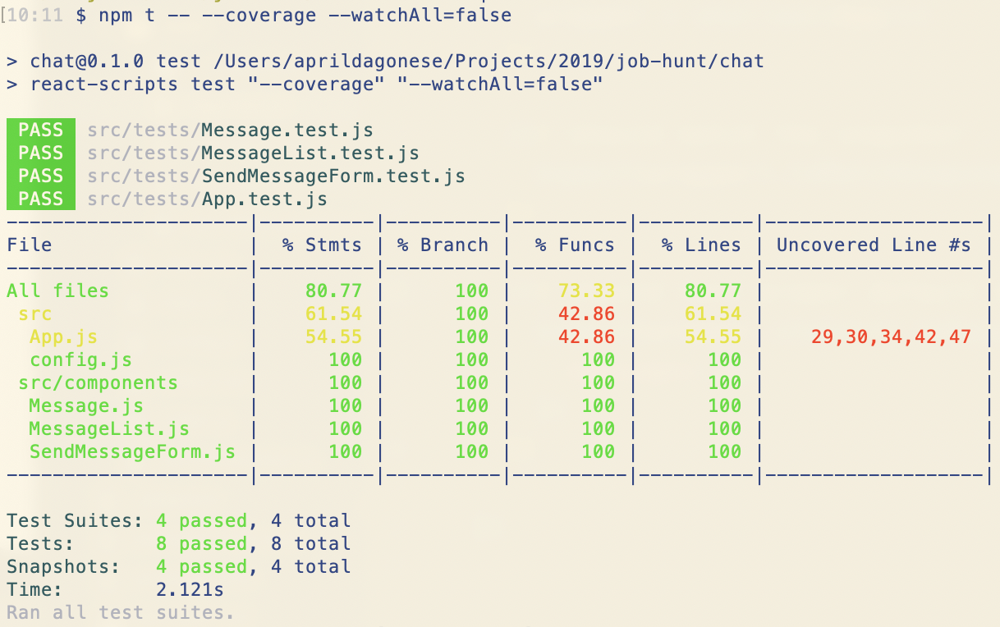

## Simple Chat App to Impress Eric Spery

This project is a simple chat app that allows 2 users to exchange messages in a browser window, simply running on localhost alone.

In order to use the app with a friend, follow the instructions below.

## Table of Contents
[Instructions](#instructions)  
[Tech Stack](#tech-stack)  
[Background on Implementation Decisions](#background-on-implementation-decisions)  
[Known Issues](#known-issues)  
[Test Coverage](#test-coverage)  

## Instructions
1. Make a friend. Tell them to follow these instructions.
2. Fork and clone this repository into the directory of your choice.
3. `cd` into your newly created app directory. Run `npm install` to install dependencies.
4. Open the app in your preferred code editor, and find the file `chat/src/app.js`
5. With your friend, determine who will be "User 1" and who will be "User 2". If you are "User 1", skip this step and move to step 6. If you are "User 2", find the `componentDidMount` function inside of `app.js`, and change the `userId` field to `User 2` (it will be set as `User 1` by default.) NOTE: At this time, these are the only 2 userIds authorized to use the app.

6. Run `npm start`
7. Your browser should automatically load from your local server, but if it does not, navigate to [http://localhost:3000](http://localhost:3000). NOTE: The page will reload every time you make edits to the source code.
8. In the browser, type a message and click enter to see your message displayed in the room. Once your friend messages back, you will see their messages displayed as well.
9. Happy chatting!

## Tech Stack
- [Create React App](https://github.com/facebook/create-react-app)
- [Pusher Chatkit](https://pusher.com/chatkit)
- [Jest](https://jestjs.io/)
- [Enzyme](https://airbnb.io/enzyme/)

## Background on Implementation Decisions
 This project was my first exposure to writing a chat app. My first thought for how to create a simple messenger with near-real-time, 2-directional communication was to hand roll a backend using Rails and websockets. This option was tempting because I'm most familiar with Rails and its go-to test suites, and because I could easily have built a frontend directly into the one service. I had never worked with websockets before, though, and I knew that other newbies have struggled with it in the past. Because this would have taught me the most and given me the greatest control over the message exchange, I still would have gone down this route, given additional time.

 The guidelines for time were 1-4 hours, however, so I investigated alternatives. I came across Pusher's Chatkit API, which had excellent documentation and appeared to be easy to implement. Because Pusher's service took care of the full message exchange and storage, and because I know that I can be slow at figuring out new technologies, this seemed like the best way to deliver an MVP in about 4 hours. This way, I would only need to focus on a frontend that consumed the Chatkit API, and it would probably give me time to play around with testing options, which I've had very little experience with in React.
 
 I'm about 6-8 hours in now (including documentation time, testing time, and fighting with an attempted Heroku deploy), and I've produced a working basic chat app. I hit the goal of implementing some testing, and I'm pretty happy with my documentation. I'm irrationally annoyed that I didn't get autoscrolling to work on the MessagesList, but I'm forcing myself to step away from this now, before I accidentally spend another 8 hours. I also hit an issue with Heroku that I haven't seen before, where the build appears to be successful, but no content is displayed. If I had more time, I would love to figure out what's going on there.
 
 Overall, I'm pleased with my approach. Other than the fact that I have a dependency on a 3rd-party service, I think this was an efficient way of accomplishing a basic task that I've never done before. I did rely heavily on online tutorials for Chatkit and testing, which I want to be transparent about.

## Known Issues
 1. MessageList does not autoscroll to the bottom on overflow. (It does scroll, but you have to do it manually any time new messages are added.)
 2. Heroku build is showing successful, but displaying only a blank screen. Production config likely needs adjusting. https://rocky-citadel-71749.herokuapp.com/
 3. The app is currently using Chatkit's test token provider in place of any real authentication.

## Test Coverage
Test coverage is currently at about 80%, with untested lines mainly limited to interaction with Chatkit's API. I looked briefly at implementing mocks to improve coverage, but since I was already over time on the project, I decided just to notate it as a future improvement.

