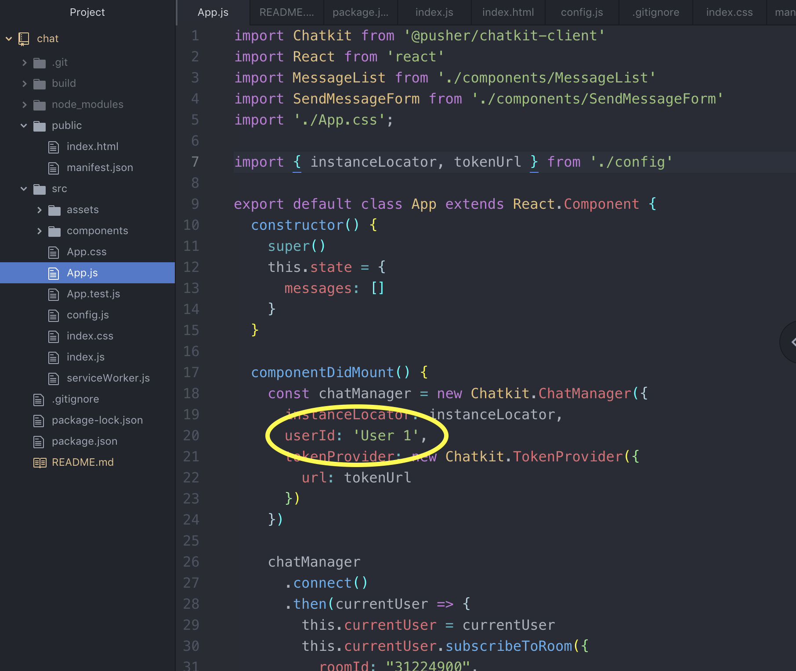

## Simple Chat App to Impress Eric Spery

This project is a simple chat app that allows 2 users to exchange messages in a browser window, simply running on localhost alone.

In order to use the app with a friend, simply follow the instructions below.

## Instructions
1. Make a friend. Tell them to follow these instructions.
2. Fork and clone this repository into the directory of your choice.
3. Run `npm install` to install dependencies.
4. Open the app in your preferred code editor, and navigate to `chat/src/app.js`
5. With your friend, determine who will be "User 1" and who will be "User 2". If you are "User 1", skip this step and move to step 6. If you are "User 2", find the `componentDidMount` function inside of `app.js`, and change the `userId` field to `User 2` (it will be set as `User 1` by default.)

6. Run `npm start`
7. Your browser should automatically load from your local server, but if it does not, navigate to [http://localhost:3000](http://localhost:3000). The page will reload if you make edits to the source code.
8. In the browser, type a message and click enter to see your message displayed in the room.
9. Happy chatting!

## Tech Stack
- [Create React App](https://github.com/facebook/create-react-app)
- [Pusher Chatkit](https://pusher.com/chatkit)

## Background on Design Decisions
 This project was my first exposure to writing a chat app. My first thought for how to create a simple messenger with near-real-time, 2-directional communication was to hand roll a backend using Rails and websockets. This option was tempting because I'm most familiar with Rails and its go-to test suites, and because I could easily have built a frontend directly into the one service. I had never worked with websockets before, though, and I knew other newbies who had struggled with it in the past. Because this would have taught me the most and given me the greatest control over the message exchange, I still would have gone down this route given additional time.

 Because the guidelines for time were 1-4 hours, however, I started investigating alternatives. I came across Pusher's Chatkit API, which had excellent documentation and appeared to be easy to implement. Because Pusher's service took care of the full message exchange and storage, and because I know that I can be slow at figuring out new technologies, this seemed like the best way to deliver an MVP in close to 4 hours. (Which ended up more like 6-8 hours, including documentation time and fighting with an attempted Heroku deploy.) I would only need to focus on a frontend that consumed the Chatkit API. This choice would also allow me to play around with testing options, which I've had very little experience with in React.
